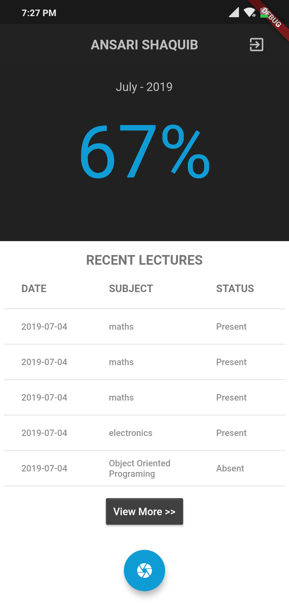
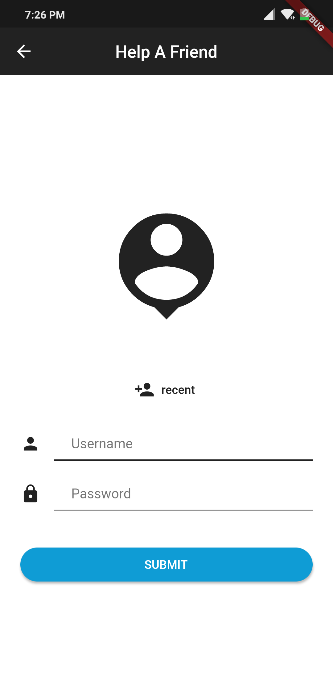
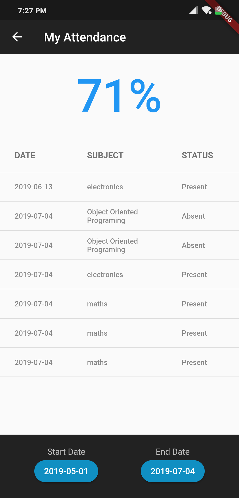
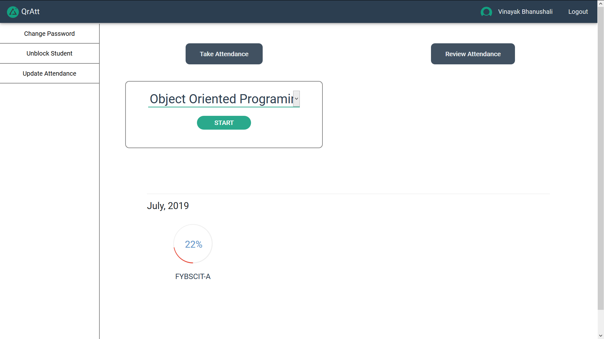
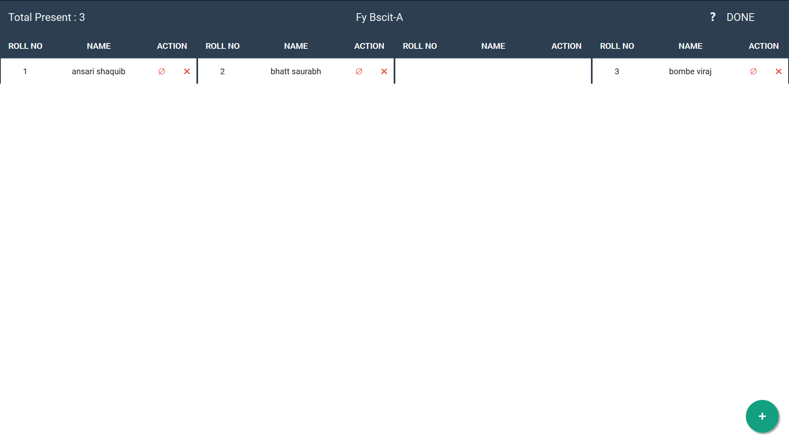
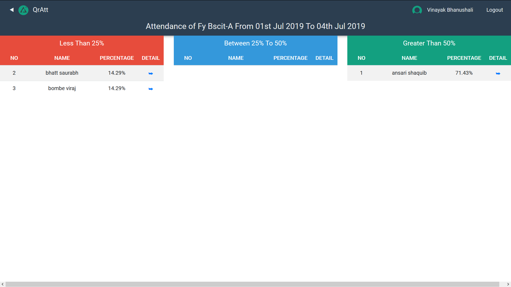
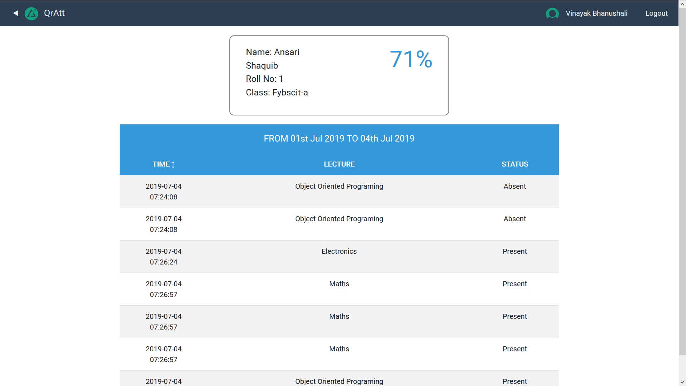

# QrAtt
Attendance Using Qr Codes
------------
An attendance system which generates QR codes dynamically every 'n' seconds to keep the attendance taking secure. This system also has proxy detection module and like every automated system makes the proccess fast. This system is designed with Colleges in mind but it can also be used for Workplaces .The complete list for features can be found [here](#features)
This system is made using Flutter frontend and PHP MYSQL backend

App (Flutter)
------------

Help a friend
------------

Details
------------

Success
------------

Admin/Teacher (PHP MYSQL)
------------

Current Attendance
------------

Overall Report
------------

Individual Report
------------

### Features
- Proxy Prevention
- Proxy Detection
- Quick and Easy Attendance Reports
- Admin Portal
- Faster Attendance taking process

Authors
------------
- [Vinayak Bhanushali ](https://github.com/Vinayak-Bhanushali "Vinayak Bhanushali ")
- [Parth Bhinde](https://github.com/parthbhinde "Parth Bhinde")

The Mobile version of this app is also made in React Native by [Parth Bhinde ](https://github.com/parthbhinde/Attendance-Using-QR-Code#features "Parth Bhinde")

